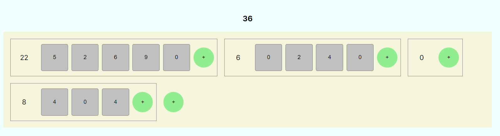

# Sandwich Feast

Tento test ověřuje následící schopnosti a dovednosti:
* pochopení contextu
* použití reduceru
* jejich společná integrace
  * definice potřebných datových typů
  * definování akcí reduceru
  * exportování potřebných komponent
* aplikace vytvořeného provideru
  * volání akcí
  * volání funkcí nad state

Vytvořte aplikaci pro evidenci snědených chlebíčků během soutěže jedlíků. Soutěž funguje tak, že probíhá tak dlouho, dokud všichni soutěžící neodpadnou, pak se vyhodnotí největší jedlík a nejnajedenější stůl.

## Zadání

Datová struktura se skládá z herny ve které se nacházejí stoly u kterých se nacházejí židličky. Ke každé židličce evidujeme počet chlebíčků. které na ní byly snědeny. U každého stolu evidujeme celkový součet chlebíčků ze všech jeho židliček. Dále evidujeme celkový počet snědených chlebíčků.

Je tak možné:
* přidávat chlebíčky na židličce
* přidávat židličky ke stolu
* přidávat nové stoly

## Datová struktura

    export type FeastState = { tables: Table[]};
    export type Table = { seats: Seat[]};
    export type Seat = { items: number };